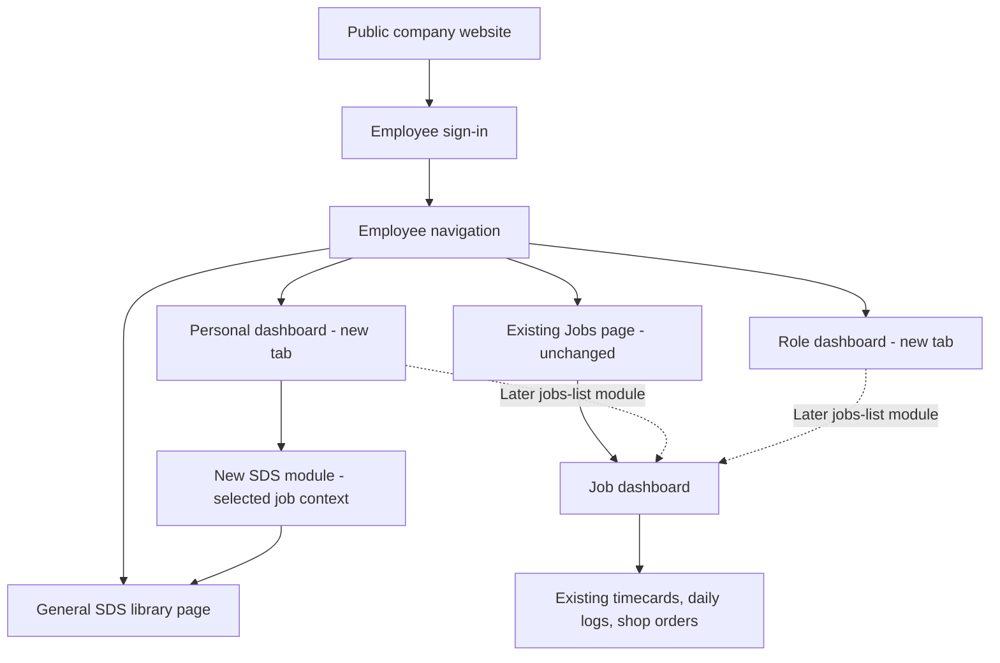

# People, workspaces, reports, and public content

Draft proposals supporting the [requirements register](01-requirements.md). SDS delivery can begin before the broader workspace redesign is complete.

## Information architecture

Arrows indicate navigation or shared information, not permission grants. Public content and employee records have separate publishing and access boundaries.

Confirmed initial structure: add separate **Personal Dashboard** and **Role Dashboard** pages/tabs alongside the existing **Jobs** page. Clicking a job in the current list continues opening that job's existing dashboard, which already offers Timecards, Daily Logs, and Shop Orders. The Job dashboard is contextual to a selected job; it is not a global tab with an unspecified job.

**Confirmed boundary: the entire existing Jobs area stays untouched for this initial work.** This includes the Jobs list, every existing Job dashboard/page, its three workflow options, and associated routes, permissions, and behavior. Do not add SDS cards/modules, change layouts, refactor these pages, replace them, or redirect them. New Personal and Role entries are additive and preserve the current Jobs navigation and post-login landing behavior. Shared component or routing work must not change how existing Jobs screens behave. Safety/SDS remains a separate content page, not a fourth dashboard type.

Later, a reusable jobs-list module can appear on Personal and Role dashboards and open the same job dashboards. The user intends to retire the standalone Jobs page eventually. That migration is a separate later step, after the module covers the existing page's relevant workflows and preserves links. Earlier group-dashboard requests remain a future design input; they do not add a fourth initial dashboard type or imply that roles and custom groups are interchangeable.

## Roles, titles, capabilities, and scope

Use business titles for identity, capabilities for actions, and job/group membership for scope. This is a design recommendation; a custom role editor has not been explicitly requested.

| Category | Requested baseline | Decisions still needed |
| --- | --- | --- |
| Admin | Full access; adds SDS information and manages master library | Public publishing delegation |
| Payroll | Create jobs; timecard export | Other job editing, document access, site visit visibility |
| Foreman | Assigned jobs and field workflows; selects/exports SDS for accessible jobs | Group creation, shared dashboard editing |
| Shop Foreman | Read all jobs; edit shop job; selects/exports SDS for all accessible jobs | Site visit permissions |
| Project Manager | Edit jobs without deleting/archiving; job dashboards; assigned-job log/order emails; site visit reports | Job scope, timecard visibility and wage access, report management |
| Superintendent | PM-like capabilities; site visits; shop orders | Exact scope and differences from PM |
| Operations | PM-like capabilities; site visits; shop orders | Exact scope and differences from PM |
| CEO | PM-like capabilities; site visits; shop orders | Company-wide access, reporting expectations |

Do not automatically grant Admin to leadership titles. Do not assume the job-read permission also grants access to payroll details, private notes, personnel files, or unpublished reports.

Confirmed SDS exception to ordinary job editing: anyone with access to a job can edit that job's SDS inclusion and export/print its book. This applies across roles, including read-only job access. Admin alone maintains the master SDS library. Implement these rules on new SDS surfaces without broadening existing job-edit permissions.

Proposed capability families: read job; edit job; submit each report/workflow; view sensitive timecard details; manage job binder; curate company safety documents; manage group membership; edit shared dashboard; manage website drafts; publish website. Final names and storage representation are implementation decisions.

Record the approved permission matrix centrally, then verify it at route, data, callable, search, export, and file-access boundaries. Access changes should affect active sessions and cached views according to a defined policy.

## Dashboard behavior

Each dashboard is a layout over shared records, not another independent record system.

| Scope | Contents | Proposed editing model |
| --- | --- | --- |
| Personal | The signed-in person's work and private material; own tasks/submissions/events as modules arrive | Separate page/tab with a fixed starting layout; personal customization follows later |
| Role | Consistent shared resources and tools for users of the same role; Admin, Foreman, and PM have different needs | Separate page/tab; shared role-specific starting layout with per-viewer authorized records; layout/resource publishing ownership remains open |
| Job | Existing work and information belonging to the selected job | Existing dashboard/pages remain untouched; module placement and redesign are deferred |

Personal and Role are separate destinations, even if their initial modules overlap. The user confirmed that Role dashboards provide consistency and shared resources/tools for each role; they are not simply another personal work list. Use a common starting arrangement for each role and filter underlying records to each viewer's permissions. Sharing a role does not expose private tasks or grant all-job access. Multi-role selection and who maintains role layouts/resources remain open; the first design does not require a role editor. Future custom-group workspaces need their own ownership and membership decisions.

Proposed first role content: Admin has master SDS management and existing permitted administration tools; Foreman has shared field resources and SDS access; Project Manager has shared project-management resources and permitted tool links. These are initial content suggestions, not permission grants or requests to rebuild existing workflows. Personal remains the home for the individual's own information.

The user confirmed that the explorer should be generalized into a dashboard module and that basic dashboards are sufficient initially. Start with fixed, responsive module placements and existing workflow links. The later dashboard expansion adds the module catalog, user-added modules, removal, and rearrangement; these remain in phase scope. Drag-and-drop needs an accessible Move up/down or position control. A mobile layout should have a predictable reading order instead of a shrunken desktop grid.

Every module needs a title, scope, loading/empty/error states, refresh behavior, and a link to the underlying full page. Display data timestamps where stale information would affect a decision. A module error must not blank the dashboard.

| Module family | Included requests | Design notes |
| --- | --- | --- |
| Jobs and submissions | Future jobs-list module, personal work, recent reports | Current Jobs page stays untouched initially; later module links to existing job dashboards and reuses approved visibility rules |
| Alerts | Missing timecards/logs/site visit reports, due tasks | Requires due dates, applicability, completion rules, and responsible people |
| Announcements | Job/group/company updates; prominent notices | Authoring permissions, audience, publication/expiry, and optional acknowledgement must be defined |
| Calendar | Personal/job events, permits, inspections | Time zones, reminders, ownership, recurrence, and external sync need decisions |
| Notes and checklist | Notes, to-dos, completed work | Separate private notes from shared tasks; define assignee and completion history |
| Document explorer | Folder tree, document list/preview, pins, SDS binder and book output | Reusable module; SDS is the first configured collection, with its own selection/revision rules |
| Media | Photo/PDF viewers and galleries | Scope-limited previews and links; failures remain local to the module |
| Map and contacts | Job location and project contacts | Mapping provider and contact visibility still open |
| Analytics | Pie/bar/line charts, assigned-job statistics | Specify business questions and source metrics before selecting charts |
| Spreadsheet | Possible integration | Decide whether this means upload, export, embedded viewing, or synchronization |

## Document explorer module and initial dashboards

Confirmed direction: deliver the SDS explorer as a reusable dashboard module, starting on basic dashboards. Preserve the master library, job checkbox selection, and PDF/print book requirements. Proposed module name: **Document explorer**; user-facing titles identify its contents, such as **SDS Library** or **Job SDS**.

| Initial surface | Proposed contents |
| --- | --- |
| General SDS library page | Expanded master explorer, available through Safety/SDS; a content page rather than a separate dashboard type |
| Existing Job dashboard/pages | No changes or added modules in this initial work |
| Personal dashboard (new page/tab) | Simple fixed layout; proposed master SDS explorer and shortcut to the unchanged Jobs page; personal modules grow later |
| Role dashboard (new page/tab) | Consistent role-specific layout for shared resources and relevant tools; Admin SDS management differs from Foreman/PM reader and job-selection actions; exact resources remain to be chosen |

The master explorer may also be placed on Role dashboards where useful; all instances reference the same company library. Its first default dashboard placement is a proposal, not a reason to introduce a fourth dashboard type. A shortcut to Jobs is ordinary navigation, not the later jobs-list module.

To keep job-specific SDS in scope without touching existing job pages, propose a job selector inside the new SDS module/page reached from Personal or Role. It selects an authorized job's binder context and uses its saved sheet selection; it is not a replacement Jobs list or a change to the existing Job dashboard. Exact placement remains for review. Direct placement on existing Job dashboards is deferred until the user revisits the current boundary.

Use existing dashboard/page layouts where practical. The module must offer actual folder browsing and document actions on the dashboard, with an expanded full-page view for more room. A link-only tile would not fulfill this explorer-module design. On mobile, retain the successive folder/list/document navigation described in the SDS design.

Proposed reusable behavior:

- A module identifies its source collection, owner/view scope, title, and initial folder. SDS-specific behavior is configured by the collection's type and permissions.
- The shared explorer handles folder navigation, ordered document lists, search, selection, opening/previewing, and supported download/print/book actions.
- The SDS configuration supplies product/manufacturer/revision details, the company master source, saved job inclusion, and revision review. Other collections can later hold manuals, job documents, or personal/group files without inheriting SDS-specific fields or automatically sharing their contents.
- Source collections own documents and organization; job binders own saved inclusion selections; dashboards own placement/display preferences. Two modules showing the same job binder see the same saved sheets. Removing a module later removes its placement, not the binder or files.
- Job **Edit selection** changes which SDS sheets belong in that job's view/book. **Edit library** changes the master organization. Later **Customize dashboard** changes module layout. These actions have distinct permissions and labels.
- Collection and document capabilities determine available output actions. SDS requires combined PDF/print books; arbitrary non-PDF files in future general collections need a separate conversion/output decision.

Fixed placements can later become editable module configurations without moving documents or rebuilding job selections. The first release adds Personal and Role pages/tabs and separate SDS views; it leaves all existing Job dashboards/pages untouched. Master and job SDS collection configurations can share the new explorer. Additional personal/role/group file modules and advanced dashboard controls follow in later workspace stages.

Acceptance for the initial dashboard work: users can browse the general/job explorer in place, expand it and return with context intact, and use the same saved selection and book output from either view. Permission changes affect both views; one module's failure leaves navigation and existing workflow links usable. New dashboard presentation does not create drafts or change submission behavior.

Navigation acceptance: Personal and Role have distinct reachable pages/tabs; all original Jobs pages/dashboards remain unchanged, including their appearance and behavior; selecting a job still opens the same dashboard and its three working options. Direct job links continue working. No SDS module is inserted into existing Job pages. Role modules filter records to the viewer's access. No Jobs-page retirement or default-landing change is bundled into this initial release.

## Site visit report

Provide a distinct report linked to a job rather than requiring a complete daily log. Proposed metadata: author, visit date/time, job, draft/submitted state, and submission history.

| Section | Consolidated requested information |
| --- | --- |
| Site visited | Job/site |
| GC conversations | Repeatable person contacted and topics discussed |
| Personnel/manpower | Choose total headcount or department breakdown, using daily-log terminology |
| Site activities | Conditions, progress, and issues |
| Observations | Items noted |
| Actions taken | Specific items addressed |
| Quality control | QC discussion |
| Safety | Safety compliance observations |
| Equipment and logistics | Equipment/logistics notes |
| Follow-up plan | Next actions; proposed assignee and due date when applicable |
| Schedule | Schedule discussion or impact |

Field requiredness, department names, attachments, signatures, recipients, and whether counts refer to Phase 2 personnel or everyone on site remain open. Avoid double counting: choose either total-count or department mode for one personnel entry.

Proposed lifecycle: explicitly create draft → save progress → validate → submit → record delivery status. Opening a date/job does not create a draft. Keep submitted versions intact; corrections create a traceable revision or use an explicitly approved reopen policy.

For mandatory visits, a proposed model is a scheduled visit or explicit visit entry assigned to a person. It can then be marked report due, completed, or cancelled with a reason. The app cannot infer every physical visit from login activity. GPS/check-in is not an approved requirement. Define the due period, exemptions, and escalation recipients before building reminders.

Site visit acceptance: an authorized PM/superintendent can complete the agreed short form; another role cannot submit it without permission; revisiting it creates nothing; expected recipients and the author receive its submitted version if that email policy is adopted; a recorded visit with a missing report becomes visible to the designated owner.

## Report builder

Two interpretations must be resolved before detailed implementation:

1. Reusable developer-built templates for reports similar to daily logs.
2. An admin-facing builder that creates and publishes templates without code.

Recommended common foundation for either: job/author context, sections and field types, required-field validation, explicit drafts, template versions, submission snapshots, attachment references, and configurable email output.

If an admin builder is selected, proposed initial controls are text, long text, date/time, number, choice, personnel count, and repeatable conversation/follow-up items. Conditional fields, formulas, signatures, approvals, and custom PDF layout need explicit scope within the builder design; do not silently assume arbitrary scripting.

Draft template → preview with sample data → publish version → use for new reports. Editing a template never rewrites old submissions. Templates are configured data, not executable user-authored code. Reuse proven parts of daily-log behavior without forcing a migration of existing logs before the new report works.

## Documents and notifications

Documents have an owner, scope, source/file, revision history, and allowed audience. Folder trees and pinned documents are views over those records. Sharing a personal document into a job or group should be explicit and should not expose neighboring personal files.

SDS has specialized identity, source, and binder rules detailed in [the SDS design](02-sds-design.md). Its master explorer defines the organization and book table of contents. Job edit-mode checkboxes choose the sheets visible in that job and included in its PDF/printed book; jobs inherit the master hierarchy. Master curation and job selection are separate permissions. General document storage should reuse compatible primitives while retaining these distinctions.

Proposed notification policy records event, audience, delivery channel, and result. Keep submission-copy behavior already delivered. PM recipients are based on approved job assignments. Define new site visit recipients, group announcements, due-work reminders, and digest preferences separately. Retry handling must avoid duplicate sends. Dashboard alerts should reflect the underlying task/report state rather than treating email success as completion.

Reply-To directs normal replies to the submitter. It does not make messages visible inside the app or redistribute replies to a mailing list. Neither behavior should appear in product promises without a separate decision.

## Public website and admin editing

Latest requested navigation: Company, Location, Safety, Careers, Insights, Projects. Proposed content placement:

| Area | Content |
| --- | --- |
| Company | Who we are; office, superintendent, operations, and safety biographies; awards |
| Location | Office/service-area information; confirm single versus multiple locations |
| Safety | Approved company safety messaging and suitable public resources; employee SDS entry may link to sign-in |
| Careers | Opportunities and recruiting information; applications/form handling still open |
| Insights | Company news, achievements, and articles |
| Projects | Project summaries, photos, categories, and approved facts |
| Services placement to decide | Estimating, budgeting, preconstruction, takeoffs; preserve a discoverable entry point |

Use the requested J. E. Dunn reference to discuss layout and navigation with original Phase 2 content and branding. No detailed reference-site review has been performed yet.

Proposed admin flow: edit structured content → preview → publish → retain revision/rollback. Restrict uploaded media, sanitize rich content, and provide image descriptions/alt text. Editing content must not provide arbitrary script injection or access to employee data. A draft page must not be retrievable from public APIs or search indexes.

Decide domain structure and employee-login placement before changing the existing app URL. Preserve existing shared links, email links, and password setup routes. Identify owners for biographies, photo permission, awards, project facts, and ongoing careers/news updates.

## Safety knowledge and JHA tools

Build on the safety library with source-level access and revision metadata. Search approved documents first; any generated answer links to exact supporting material and identifies missing evidence. Product-specific guidance is not inferred from a similar product's SDS.

JHA assistance needs its own workflow: task definition → relevant source selection → proposed hazards/controls → responsible-person review → issued report/version. The expected fields, risk scoring method, reviewer, and signature requirements depend on the missing example and stakeholder decisions.

Treat OSHA reference search, enforcement/inspection data, and company incident analytics as separate sources and features. Verify their usefulness and availability before selecting APIs. The copied Copilot advice is not a verified technical specification or an approved safety procedure.

Toolbox talks, hazard recognition, incident trends, and training tracking remain in scope. Define their records, audiences, and review responsibilities during detailed design. Sensitive incident/personnel information must not flow automatically into general dashboards or the public website.
