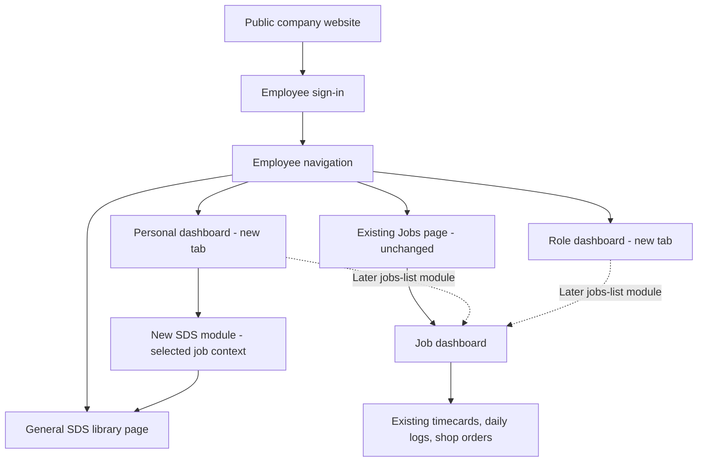

# People, workspaces, reports, and public content

Draft proposals supporting the [requirements register](01-requirements.md). SDS delivery can begin before the broader workspace redesign is complete.

## Information architecture

```mermaid
flowchart TD
    Public[Public company website] --> Login[Employee sign-in]
    Login --> Nav[Employee navigation]
    Nav --> Personal[Personal dashboard - new tab]
    Nav --> Role[Role dashboard - new tab]
    Nav --> Jobs[Existing Jobs page - unchanged]
    Jobs --> Job[Job dashboard]
    Nav --> Library[General SDS library page]
    Personal --> Binder[New SDS module - selected job context]
    Binder --> Library
    Job --> Work[Existing timecards, daily logs, shop orders]
    Personal -. Later jobs-list module .-> Job
    Role -. Later jobs-list module .-> Job
```

Arrows indicate navigation or shared information, not permission grants. Public content and employee records have separate publishing and access boundaries.

Confirmed initial structure: add separate **Personal Dashboard** and **Role Dashboard** pages/tabs alongside the existing **Jobs** page. Clicking a job in the current list continues opening that job's existing dashboard, which already offers Timecards, Daily Logs, and Shop Orders. The Job dashboard is contextual to a selected job; it is not a global tab with an unspecified job.

**Confirmed boundary: the entire existing Jobs area stays untouched for this initial work.** This includes the Jobs list, every existing Job dashboard/page, its three workflow options, and associated routes, permissions, and behavior. Do not add SDS cards/modules, change layouts, refactor these pages, replace them, or redirect them. New Personal and Role entries are additive and preserve the current Jobs navigation and post-login landing behavior. Shared component or routing work must not change how existing Jobs screens behave. Safety/SDS remains a separate content page, not a fourth dashboard type.

Later, a reusable jobs-list module can appear on Personal and Role dashboards and open the same job dashboards. The user intends to retire the standalone Jobs page eventually. That migration is a separate later step, after the module covers the existing page's relevant workflows and preserves links. Earlier group-dashboard requests remain a future design input; they do not add a fourth initial dashboard type or imply that roles and custom groups are interchangeable.

## Roles, titles, capabilities, and scope

Use business titles for identity, capabilities for actions, and job/group membership for scope. This is a design recommendation; a custom role editor has not been explicitly requested.

| Category | Requested baseline | Decisions still needed |
| --- | --- | --- |
| Admin | Full access; adds SDS information and manages master library | Public publishing delegation |
| Payroll | Create jobs; timecard export | Other job editing, document access, site visit visibility |
| Foreman | Assigned jobs and field workflows; selects/exports SDS for accessible jobs | Group creation, shared dashboard editing |
| Shop Foreman | Read all jobs; edit shop job; selects/exports SDS for all accessible jobs | Site visit permissions |
| Project Manager | Edit jobs without deleting/archiving; job dashboards; assigned-job log/order emails; site visit reports | Job scope, timecard visibility and wage access, report management |
| Superintendent | PM-like capabilities; site visits; shop orders | Exact scope and differences from PM |
| Operations | PM-like capabilities; site visits; shop orders | Exact scope and differences from PM |
| CEO | PM-like capabilities; site visits; shop orders | Company-wide access, reporting expectations |

Do not automatically grant Admin to leadership titles. Do not assume the job-read permission also grants access to payroll details, private notes, personnel files, or unpublished reports.

Confirmed SDS exception to ordinary job editing: anyone with access to a job can edit that job's SDS inclusion and export/print its book. This applies across roles, including read-only job access. Admin alone maintains the master SDS library. Implement these rules on new SDS surfaces without broadening existing job-edit permissions.

Proposed capability families: read job; edit job; submit each report/workflow; view sensitive timecard details; manage job binder; curate company safety documents; manage group membership; edit shared dashboard; manage website drafts; publish website. Final names and storage representation are implementation decisions.

Record the approved permission matrix centrally, then verify it at route, data, callable, search, export, and file-access boundaries. Access changes should affect active sessions and cached views according to a defined policy.

## Dashboard behavior

Each dashboard is a layout over shared records, not another independent record system.

| Scope | Contents | Proposed editing model |
| --- | --- | --- |
| Personal | The signed-in person's work and private material; own tasks/submissions/events as modules arrive | Separate page/tab with a fixed starting layout; personal customization follows later |
| Role | Consistent shared resources and tools for users of the same role; Admin, Foreman, and PM have different needs | Separate page/tab; shared role-specific starting layout with per-viewer authorized records; layout/resource publishing ownership remains open |
| Job | Existing work and information belonging to the selected job | Existing dashboard/pages remain untouched; module placement and redesign are deferred |

Personal and Role are separate destinations, even if their initial modules overlap. The user confirmed that Role dashboards provide consistency and shared resources/tools for each role; they are not simply another personal work list. Use a common starting arrangement for each role and filter underlying records to each viewer's permissions. Sharing a role does not expose private tasks or grant all-job access. Multi-role selection and who maintains role layouts/resources remain open; the first design does not require a role editor. Future custom-group workspaces need their own ownership and membership decisions.

Proposed first role content: Admin has master SDS management and existing permitted administration tools; Foreman has shared field resources and SDS access; Project Manager has shared project-management resources and permitted tool links. These are initial content suggestions, not permission grants or requests to rebuild existing workflows. Personal remains the home for the individual's own information.

The user confirmed that the explorer should be generalized into a dashboard module and that basic dashboards are sufficient initially. Start with fixed, responsive module placements and existing workflow links. The later dashboard expansion adds the module catalog, user-added modules, removal, and rearrangement; these remain in phase scope. Drag-and-drop needs an accessible Move up/down or position control. A mobile layout should have a predictable reading order instead of a shrunken desktop grid.

Every module needs a title, scope, loading/empty/error states, refresh behavior, and a link to the underlying full page. Display data timestamps where stale information would affect a decision. A module error must not blank the dashboard.

| Module family | Included requests | Design notes |
| --- | --- | --- |
| Jobs and submissions | Future jobs-list module, personal work, recent reports | Current Jobs page stays untouched initially; later module links to existing job dashboards and reuses approved visibility rules |
| Alerts | Missing timecards/logs/site visit reports, due tasks | Requires due dates, applicability, completion rules, and responsible people |
| Announcements | Job/group/company updates; prominent notices | Authoring permissions, audience, publication/expiry, and optional acknowledgement must be defined |
| Calendar | Personal/job events, permits, inspections | Time zones, reminders, ownership, recurrence, and external sync need decisions |
| Notes and checklist | Notes, to-dos, completed work | Separate private notes from shared tasks; define assignee and completion history |
| Document explorer | Folder tree, document list/preview, pins, SDS binder and book output | Reusable module; SDS is the first configured collection, with its own selection/revision rules |
| Media | Photo/PDF viewers and galleries | Scope-limited previews and links; failures remain local to the module |
| Map and contacts | Job location and project contacts | Mapping provider and contact visibility still open |
| Analytics | Pie/bar/line charts, assigned-job statistics | Specify business questions and source metrics before selecting charts |
| Spreadsheet | Possible integration | Decide whether this means upload, export, embedded viewing, or synchronization |

## Document explorer module and initial dashboards

Confirmed direction: deliver the SDS explorer as a reusable dashboard module, starting on basic dashboards. Preserve the master library, job checkbox selection, and PDF/print book requirements. Proposed module name: **Document explorer**; user-facing titles identify its contents, such as **SDS Library** or **Job SDS**.

| Initial surface | Proposed contents |
| --- | --- |
| General SDS library page | Expanded master explorer, available through Safety/SDS; a content page rather than a separate dashboard type |
| Existing Job dashboard/pages | No changes or added modules in this initial work |
| Personal dashboard (new page/tab) | Simple fixed layout; proposed master SDS explorer and shortcut to the unchanged Jobs page; personal modules grow later |
| Role dashboard (new page/tab) | Consistent role-specific layout for shared resources and relevant tools; Admin SDS management differs from Foreman/PM reader and job-selection actions; exact resources remain to be chosen |

The master explorer may also be placed on Role dashboards where useful; all instances reference the same company library. Its first default dashboard placement is a proposal, not a reason to introduce a fourth dashboard type. A shortcut to Jobs is ordinary navigation, not the later jobs-list module.

To keep job-specific SDS in scope without touching existing job pages, propose a job selector inside the new SDS module/page reached from Personal or Role. It selects an authorized job's binder context and uses its saved sheet selection; it is not a replacement Jobs list or a change to the existing Job dashboard. Exact placement remains for review. Direct placement on existing Job dashboards is deferred until the user revisits the current boundary.

Use existing dashboard/page layouts where practical. The module must offer actual folder browsing and document actions on the dashboard, with an expanded full-page view for more room. A link-only tile would not fulfill this explorer-module design. On mobile, retain the successive folder/list/document navigation described in the SDS design.

Proposed reusable behavior:

- A module identifies its source collection, owner/view scope, title, and initial folder. SDS-specific behavior is configured by the collection's type and permissions.
- The shared explorer handles folder navigation, ordered document lists, search, selection, opening/previewing, and supported download/print/book actions.
- The SDS configuration supplies product/manufacturer/revision details, the company master source, saved job inclusion, and revision review. Other collections can later hold manuals, job documents, or personal/group files without inheriting SDS-specific fields or automatically sharing their contents.
- Source collections own documents and organization; job binders own saved inclusion selections; dashboards own placement/display preferences. Two modules showing the same job binder see the same saved sheets. Removing a module later removes its placement, not the binder or files.
- Job **Edit selection** changes which SDS sheets belong in that job's view/book. **Edit library** changes the master organization. Later **Customize dashboard** changes module layout. These actions have distinct permissions and labels.
- Collection and document capabilities determine available output actions. SDS requires combined PDF/print books; arbitrary non-PDF files in future general collections need a separate conversion/output decision.

Fixed placements can later become editable module configurations without moving documents or rebuilding job selections. The first release adds Personal and Role pages/tabs and separate SDS views; it leaves all existing Job dashboards/pages untouched. Master and job SDS collection configurations can share the new explorer. Additional personal/role/group file modules and advanced dashboard controls follow in later workspace stages.

Acceptance for the initial dashboard work: users can browse the general/job explorer in place, expand it and return with context intact, and use the same saved selection and book output from either view. Permission changes affect both views; one module's failure leaves navigation and existing workflow links usable. New dashboard presentation does not create drafts or change submission behavior.

Navigation acceptance: Personal and Role have distinct reachable pages/tabs; all original Jobs pages/dashboards remain unchanged, including their appearance and behavior; selecting a job still opens the same dashboard and its three working options. Direct job links continue working. No SDS module is inserted into existing Job pages. Role modules filter records to the viewer's access. No Jobs-page retirement or default-landing change is bundled into this initial release.

## Site visit report

Provide a distinct report linked to a job rather than requiring a complete daily log. Proposed metadata: author, visit date/time, job, draft/submitted state, and submission history.

| Section | Consolidated requested information |
| --- | --- |
| Site visited | Job/site |
| GC conversations | Repeatable person contacted and topics discussed |
| Personnel/manpower | Choose total headcount or department breakdown, using daily-log terminology |
| Site activities | Conditions, progress, and issues |
| Observations | Items noted |
| Actions taken | Specific items addressed |
| Quality control | QC discussion |
| Safety | Safety compliance observations |
| Equipment and logistics | Equipment/logistics notes |
| Follow-up plan | Next actions; proposed assignee and due date when applicable |
| Schedule | Schedule discussion or impact |

Field requiredness, department names, attachments, signatures, recipients, and whether counts refer to Phase 2 personnel or everyone on site remain open. Avoid double counting: choose either total-count or department mode for one personnel entry.

Proposed lifecycle: explicitly create draft → save progress → validate → submit → record delivery status. Opening a date/job does not create a draft. Keep submitted versions intact; corrections create a traceable revision or use an explicitly approved reopen policy.

For mandatory visits, a proposed model is a scheduled visit or explicit visit entry assigned to a person. It can then be marked report due, completed, or cancelled with a reason. The app cannot infer every physical visit from login activity. GPS/check-in is not an approved requirement. Define the due period, exemptions, and escalation recipients before building reminders.

Site visit acceptance: an authorized PM/superintendent can complete the agreed short form; another role cannot submit it without permission; revisiting it creates nothing; expected recipients and the author receive its submitted version if that email policy is adopted; a recorded visit with a missing report becomes visible to the designated owner.

## Report builder

### October 1 confirmed direction and local implementation

The owner selected an admin-facing Form Builder: a separate admin tab with a form library, create/rename/duplicate/edit/remove actions, and archive instead of deleting templates already used or versioned. Select a form to edit it with drag/drop plus keyboard ordering, reusing Website Builder controls. Recipients are configurable. Full-page presentation comes first; later inline presentation must use the same definition and rendering component. Dan’s committee audit is the first example; starter prompts are provisional until his actual form is supplied. Existing daily logs, shop orders, timecards and user management remain independent and unchanged. Dashboard Builder follows later.

The first bounded local slice is a development-only authenticated/admin library and field editor, browser-local explicit draft saves, retained immutable template versions, validated recipient/field configuration, full-page preview, and committee audit starter. Browser saves are scoped to the authenticated user, detect stale local revisions and surface quota/corrupt-data failures; merely opening the library creates nothing. This slice performs no Firebase writes or email sending and is not a production submission store.

Verified first-slice checkpoint: 91/91 Chromium browser scenarios passed (11 Form Builder CRUD/failure/validation/desktop/phone checks plus 80 protected workflow/login checks), 8/8 focused model/navigation unit tests passed, final typecheck passed, and the production build passed with Form Builder excluded by the development guard. Desktop editor and phone full-page preview screenshots were visually reviewed. The first fixture-server run had a source-alias error; follow-up checks exposed native drag-transfer handling and a formatted inline Vue expression that prevented development compilation. Both were corrected, and the final complete 91-test run passed. Final ESLint reports zero errors and zero warnings. No Forms backend, photo uploads, emails, respondent submissions or production Form Builder release is claimed. User edits on this device require explicit Save local draft; refreshing an unsaved editor does not create a durable submission. The route temporarily reuses the existing admin-only manage-website gate during local development; the next backend slice must define and verify its own template/respondent permissions.

The backend direction below is now implemented locally and verified in the next checkpoint: admin-only template APIs with conflict/version checks; immutable issued versions; authenticated respondent drafts; required-field and photo validation; bounded Storage attachments; idempotent submissions that durably retain template version, answers and photo references before any email attempt. Delivery state is a separate record and must never erase/fail an already durable submission. Used templates are archived, never deleted. No new production rules or functions are deployed as part of this local slice.

Acceptance checks require meaningful Playwright coverage for CRUD, saved/reloaded edits, drag/keyboard ordering, preview validation, interrupted and failed save, repeated actions, archived/versioned preservation and denied non-admin access, plus affected navigation/access-control regressions. Production records, recipients and email are excluded from testing.

### Authenticated audit lifecycle: local checkpoint

Dan's original attachment `Phase2_Committee_Audit_for_website.html` was recovered and parsed without executing its scripts. Source SHA-256: `bf4be4a69fdae6e49c192cef3a404c1d58158200b08cce2a7ab42d9cfdbe09b6`. The structured source is `functions/src/committeeAudit.json`: 41 fields in Job, Quick checks, ten rated safety sections, and Inspector. It retains source options, hints and recipient `dan2@phase2co.com`. No invented audit sections remain. Needs attention or Unsatisfactory requires notes on the server; personnel is a nonnegative integer. Synthetic tests substitute test recipients and never send email.

The development profile now has real authenticated full-page respondent records, explicit durable draft creation/save/resume, stable create/save/submit request identifiers, revision conflicts, immutable issued template versions and submitted snapshots. Opening a page creates nothing. Templates already issued or used are archived; old records retain their pinned definition. A lost submission response locks editing and offers confirmation retry using the same identifier. Shared FormDefinitionFields renders the preview and response; later inline presentation can reuse it.

Admin alone edits/issues/removes templates. Active Admin, PM, Foreman and Shop Foreman may create records; only their owner edits or submits them, while Admin may read for review. These are deliberately bounded initial role policies, not new global capabilities. Server functions reread the profile and enforce ownership. Existing Firestore/Storage rules stay unchanged: direct client access to the new private collections and photo prefix is denied. No payroll access or mature workflow changes are included.

Photos pass through the authenticated callable, must belong to the same record/owner/field, and are normalized to WebP with metadata removed. Limits: JPEG/PNG/WebP, 2 MB input, 16 megapixels, five per field, twenty attached per record, forty lifetime uploads. Private view calls require record access; no public URLs are issued. The initial email output reports retained photo counts; photo email attachments are a remaining delivery decision. Photos themselves remain in the durable authenticated record.

Submission snapshots are stored before delivery. A separate delivery record tracks queued/sending/sent/failed/disabled/uncertain/not-configured states and attempt claims. Known failed or disabled delivery can be retried without modifying the submission. Concurrent retries claim once; sent messages are not resent. Ambiguous provider failure or interrupted sending requires operator review rather than automatic duplicate delivery. All emulator email is disabled, including retries.

Run `npm run dev:forms` in the normal checkout for the isolated demo profile at `http://127.0.0.1:5173/admin/forms`. Demo accounts: `admin@forms.local` and `foreman@forms.local`; synthetic password `Local-Forms-Only-123!`. This uses Auth/Firestore/Storage emulators and a loopback-only authenticated callable adapter for just the new Forms handlers, avoiding existing production triggers and Graph bindings. Firebase initialization rejects an emulator flag paired with a production project. The ordinary user devserver is preserved and does not enable durable Forms calls.

Local emulator state is excluded from Git in `.forms-local-data/`. The launcher imports the latest complete snapshot and preserves earlier snapshots. Windows/OneDrive can reject the CLI's export rename; the wrapper recovers a complete export by copying and explicitly confirms the saved snapshot. An unconfirmed export is reported as a failure. Shutdown during a power loss may lose progress since the last emulator snapshot; this local profile is not a production availability promise.

Verification: 150/150 Chromium scenarios passed (19 Forms scenarios plus 131 protected workflow/login regressions); 8/8 focused model/navigation unit tests passed; typecheck and backend compilation passed; the real backend emulator verifier passed 26 rejection checks. An actual emulator browser run also verified old submitted answers and private photos after restart, then passed real login, issuing a template, save/reload/resume, private photo upload/view, immutable submission, disabled email and containment at 1440/390 px. Production build passed with local Form Builder routes/chunks excluded; affected ESLint passed with zero errors and warnings. No Forms deployment, production records, real email, rule changes or power settings changes are authorized or performed.

### Basic control completeness checklist

Reviewed official [Bootstrap Forms overview](https://getbootstrap.com/docs/5.3/forms/overview/), [Vue form input bindings](https://vuejs.org/guide/essentials/forms.html), and [PrimeVue 4 InputText accessibility](https://v4.primevue.org/inputtext/). PrimeVue 4 documentation is the primary component checklist, as confirmed by the owner after the review; Bootstrap is a completeness reference only. The app already uses PrimeVue plus custom Vue controls/CSS; no UI framework installation or migration is planned.

| Control or behavior | Current audit checkpoint | Next bounded slice |
| --- | --- | --- |
| Text / textarea | Implemented, bounded strings, conditional required notes | Preserve |
| Number / date | Implemented, real-date and integer/minimum validation | Configurable number constraints |
| Single select / radio | Implemented with configured valid options; radio uses PrimeVue RadioButton groups | Preserve pinned options and keyboard behavior |
| Email / phone / time | Implemented in the follow-up local slice with native types/mobile input modes and shared server validation | Preserve and broaden international phone policy only if needed |
| Checkbox / multiselect | Implemented using PrimeVue Checkbox/MultiSelect; typed booleans and validated option arrays | Extend only with an explicit workflow need |
| Photo upload | Implemented privately, bounded and record-scoped | Remove/detach interaction, email attachment policy |
| Arbitrary file upload | Deferred | Requires file-type scanning/retention policy; photo support is not general-file support |
| Switch / range | Deferred presentation variants | Use only where a meaningful boolean or numeric constraint is defined |
| Labels / hints / required state | Visible labels, connected ARIA help/required/error state, first-invalid focus after controls unlock | Extend error presentation as remaining controls are added |
| Read-only / disabled | Submitted/pending confirmation and busy states lock controls | Improve readable submitted presentation |
| Keyboard / phone behavior | Native controls, keyboard ordering, 390 px checked | Explicit palette roundtrip and mobile input tests |

Password collection, arbitrary executable logic, signatures, approvals, formulas and a dashboard builder are outside this slice. Finish this audit lifecycle checkpoint before expanding the palette. Production deployment remains a separate review and authorization.

The earlier interpretations below are retained as planning history; the owner has now selected option 2:

1. Reusable developer-built templates for reports similar to daily logs.
2. An admin-facing builder that creates and publishes templates without code.

Recommended common foundation for either: job/author context, sections and field types, required-field validation, explicit drafts, template versions, submission snapshots, attachment references, and configurable email output.

If an admin builder is selected, proposed initial controls are text, long text, date/time, number, choice, personnel count, and repeatable conversation/follow-up items. Conditional fields, formulas, signatures, approvals, and custom PDF layout need explicit scope within the builder design; do not silently assume arbitrary scripting.

Draft template → preview with sample data → publish version → use for new reports. Editing a template never rewrites old submissions. Templates are configured data, not executable user-authored code. Reuse proven parts of daily-log behavior without forcing a migration of existing logs before the new report works.

## Documents and notifications

Documents have an owner, scope, source/file, revision history, and allowed audience. Folder trees and pinned documents are views over those records. Sharing a personal document into a job or group should be explicit and should not expose neighboring personal files.

SDS has specialized identity, source, and binder rules detailed in [the SDS design](02-sds-design.md). Its master explorer defines the organization and book table of contents. Job edit-mode checkboxes choose the sheets visible in that job and included in its PDF/printed book; jobs inherit the master hierarchy. Master curation and job selection are separate permissions. General document storage should reuse compatible primitives while retaining these distinctions.

Proposed notification policy records event, audience, delivery channel, and result. Keep submission-copy behavior already delivered. PM recipients are based on approved job assignments. Define new site visit recipients, group announcements, due-work reminders, and digest preferences separately. Retry handling must avoid duplicate sends. Dashboard alerts should reflect the underlying task/report state rather than treating email success as completion.

Reply-To directs normal replies to the submitter. It does not make messages visible inside the app or redistribute replies to a mailing list. Neither behavior should appear in product promises without a separate decision.

## Public website and admin editing

Latest requested navigation: Company, Location, Safety, Careers, Insights, Projects. Proposed content placement:

| Area | Content |
| --- | --- |
| Company | Who we are; office, superintendent, operations, and safety biographies; awards |
| Location | Office/service-area information; confirm single versus multiple locations |
| Safety | Approved company safety messaging and suitable public resources; employee SDS entry may link to sign-in |
| Careers | Opportunities and recruiting information; applications/form handling still open |
| Insights | Company news, achievements, and articles |
| Projects | Project summaries, photos, categories, and approved facts |
| Services placement to decide | Estimating, budgeting, preconstruction, takeoffs; preserve a discoverable entry point |

Use the requested J. E. Dunn reference to discuss layout and navigation with original Phase 2 content and branding. No detailed reference-site review has been performed yet.

Proposed admin flow: edit structured content → preview → publish → retain revision/rollback. Restrict uploaded media, sanitize rich content, and provide image descriptions/alt text. Editing content must not provide arbitrary script injection or access to employee data. A draft page must not be retrievable from public APIs or search indexes.

Decide domain structure and employee-login placement before changing the existing app URL. Preserve existing shared links, email links, and password setup routes. Identify owners for biographies, photo permission, awards, project facts, and ongoing careers/news updates.

## Safety knowledge and JHA tools

Build on the safety library with source-level access and revision metadata. Search approved documents first; any generated answer links to exact supporting material and identifies missing evidence. Product-specific guidance is not inferred from a similar product's SDS.

JHA assistance needs its own workflow: task definition → relevant source selection → proposed hazards/controls → responsible-person review → issued report/version. The expected fields, risk scoring method, reviewer, and signature requirements depend on the missing example and stakeholder decisions.

Treat OSHA reference search, enforcement/inspection data, and company incident analytics as separate sources and features. Verify their usefulness and availability before selecting APIs. The copied Copilot advice is not a verified technical specification or an approved safety procedure.

Toolbox talks, hazard recognition, incident trends, and training tracking remain in scope. Define their records, audiences, and review responsibilities during detailed design. Sensitive incident/personnel information must not flow automatically into general dashboards or the public website.

### Follow-up practical controls and responsive validation

The next local slice adds email, phone and minute-precision time controls to the same editor, retained definitions and respondent renderer. Email requires an address shape; phone accepts common punctuation with 7-15 digits (no extensions yet); time is HH:mm in 24-hour storage with the browser's local input presentation. Blank optional values stay blank; required values and malformed supplied values are checked on the server. Save/resume/submit and editor/preview roundtrips have explicit browser coverage. Password fields are excluded. PrimeVue remains installed at 4.5.5 and the main app stays in its existing unstyled/custom-CSS mode.

The phone screenshot review exposed apparent content clipping after resize, so the response now explicitly constrains its width and wraps long buttons/text. Verification measures the actual scroll pane, not only document width, and checks submitted-state resizing from desktop to phone. Error focus is delayed until the busy fieldset unlocks; server validation remains authoritative. Checkbox/radio/multiselect are implemented in the following common-choice checkpoint; arbitrary files, switches/ranges, photo email attachments and inline presentation remain deferred. No Forms release is included.

Follow-up verification: 22/22 Forms Chromium checks, 9/9 model/navigation unit checks, 29 backend emulator rejection checks, real emulator history/photo/browser smoke, production build/typecheck/backend compilation, and affected ESLint with zero errors/warnings passed. These follow the earlier 150-test protected workflow run; no mature workflow code changed in this follow-up. Desktop/phone screenshots were reviewed after the response width correction. Local Forms is excluded from the production build and remains undeployed.

### Common-choice controls: local implementation

The palette now includes Checkbox, Radio and Multiselect using installed PrimeVue 4.5.5 components in the existing unstyled/custom-CSS application. No package installation, theme migration, Bootstrap, or unrelated shared control changes are included. PrimeVue's pinned official [Checkbox accessibility](https://github.com/primefaces/primevue/blob/4.5.5/apps/showcase/doc/checkbox/AccessibilityDoc.vue), [RadioButton accessibility](https://github.com/primefaces/primevue/blob/4.5.5/apps/showcase/doc/radiobutton/AccessibilityDoc.vue), and [MultiSelect accessibility](https://github.com/primefaces/primevue/blob/4.5.5/apps/showcase/doc/multiselect/AccessibilityDoc.vue) documentation is the primary component reference.

A checkbox stores a boolean. Optional unchecked is valid false; required checkbox means it must be checked before submission. Missing draft values normalize to false. Strings such as "false", numbers and null are rejected rather than coerced. Radio stores one configured string (blank allowed in an unfinished draft). Multiselect stores an array of distinct configured strings; missing draft selection normalizes to []; required multiselect needs at least one selection. Radio/multiselect definitions use the same options editor as single select, with 2-30 unique options. The server canonicalizes multiselect selections to the definition's order, keeping repeated saves and summaries stable. Multi selections never consume photo limits or become asset IDs.

All three types survive browser-local template saves/retained versions and real authenticated respondent create/save/resume/submit. Issued definitions and submission snapshots retain original types, options and values when a later template changes. The existing Admin-only management policy and owner-only draft/submission policy are enforced by the same server handlers; no new security grants are introduced.

Visible labels and help attach to the native inputs/combobox; required/invalid state and error descriptions reach PrimeVue's accessible input through pass-through attributes. Radio groups have a named radiogroup and individual option labels. Invalid required controls receive focus after the busy fieldset unlocks. Space toggles Checkbox; native radio arrows change the selected option; MultiSelect supports arrow/Home/Enter selection and Escape dismissal. Busy/submitted state explicitly disables PrimeVue widgets, including their overlays. Phone and tablet tests measure the actual scrollable content pane.

Email summary rendering now explicitly formats booleans as Yes/No, multiselect as readable option lists or No selections, and radio as its selected value. Labels/values are HTML escaped. **Photos are viewed inside the authenticated record through its private record-scoped read callable. Current email contains photo counts only: no photo attachments, photo URLs, or private photo links are included.** Photo email delivery remains deferred.

General files, switches/ranges, and inline/dashboard rendering remain deferred; this checkpoint does not implement them or deploy Form Builder.

Common-choice verification: 158/158 Chromium checks passed (27 Forms and 131 protected-workflow checks), alongside 11 model/navigation unit checks and 43 backend emulator rejection checks. Real Auth/Firestore/Storage emulator browser coverage verified keyboard choices, draft save/reload, immutable submission, and prior audit/photo history after restart. Phone (390px) and tablet (768px) control screenshots were reviewed. Production build/typecheck/backend compilation and affected ESLint passed with zero errors/warnings. No Forms deployment, production data writes or real emails occurred.

### Local dashboard form presentation checkpoint — October 2

Personal (/dashboards/personal) and shared Role (/dashboards/role) widget layouts now support one Form widget alongside the existing palette. The layout editor chooses an issued form and either Inline (up to eight fields) or Full-page launcher. The saved configuration contains only templateId, immutable version and presentation; it stores no answers or recipients. Later issue/edit actions do not move an existing widget to a new version. Reselecting its form explicitly adopts the latest issued version. Archived/unavailable versions cannot be added to a newly saved layout. Existing retained records remain readable/resumable through their original definitions.

Both modes use FormResponseWorkspace and the same FormDefinitionFields renderer, formWorkspace service, owner drafts and immutable submissions. Opening a widget/launcher creates no record. The user's active record and template version are remembered by UID/template/version; otherwise the newest matching saved draft is resumed. Repeated Start interactions in these dashboard entry points reuse the existing unfinished draft; starting again after submission is deliberate. Inline→full-page links carry the exact record ID and version, and Return to dashboard reopens that record. Progress is saved automatically before switching views, reloading a layout, changing managed roles or entering layout edits. Failed saves block those actions and retain typed answers for retry. Save progress remains explicit; this slice does not add a background timer autosave. Browser refresh/closing warns if there are unsaved answers or a request in flight. Full-page direct entry retains its existing saved-record history.

Personal layout selection is available to the owning eligible employee. Shared role selection is Admin-only; employees can respond to their own shared role widget. Existing Forms respondent roles are unchanged: Admin, Project Manager, Foreman and Shop Foreman; Payroll/No Access are excluded. Dashboard selection never grants template authoring or broader record access. The server rereads the profile, validates template/version existence and the eight-field inline limit in the dashboard save transaction; non-owner/cross-role/unauthorized changes are rejected. Foreign-owner records readable by Admin render read-only. New form widget saves additionally require an emulator backend; production routes/palette remain disabled.

Job dashboards and the main role shortcut landing page are unchanged. FormDashboardWidget accepts only the saved identity/presentation and a supported personal/role scope, providing the reusable presentation hook; job-context placement, job scoping/ownership and a future Dashboard Builder are deferred. Existing daily logs, shop orders, timecards and user-management implementations are unchanged.

Photos remain private inside the authenticated record. Email still contains photo counts only, with no photo attachments, URLs or private links. Forms remains local and undeployed; existing historical dashboard deployment notes do not authorize releasing these changes.

Presentation verification: 166/166 broader Chromium checks passed, followed by 37/37 final affected Forms/dashboard checks after navigation/version guards (35 Forms, including eight presentation cases, plus two existing widget checks). All 26 relevant model/navigation/role-dashboard unit checks and 53 actual backend emulator rejection checks passed. Final production build/typecheck/backend compilation and affected ESLint passed with zero errors/warnings; production output contains no Form presentation component assets. Real emulator Auth browser smoke passed both presentations, owner record save/reload/switching, previous audit/photo history after restart, desktop/phone containment and disabled email. Phone/tablet fixture and desktop/phone real-emulator screenshots were reviewed. Windows/OneDrive's known Firebase export rename EPERM was recovered by the existing complete-snapshot copy mechanism; the latest demo snapshot was retained. No production data writes, real emails or Forms deployment occurred.

### Bounded Form Builder readiness review — October 2

This is a local implementation checkpoint, not completion of the whole Form Builder. Review inspected the actual emulator UI and current component/service code against Chris's explicit requirements; test totals are supporting evidence, not a substitute for missing authoring behavior.

| Requirement | Observed implemented behavior | Concrete remaining gap |
| --- | --- | --- |
| Separate Admin form library CRUD | DEV-only Admin navigation/route; server profile enforcement; create/select/title edit/save/issue; local duplicate/delete; server unused delete and archive for issued/used templates | Browser-local and emulator-server libraries remain adjacent stores, not one consolidated workflow. Server library has no direct Duplicate button; copying uses the device library path. Archived templates have no restore action. |
| Select then drag/drop authoring using familiar controls | Template selection; actual native desktop drag reordering of existing field rows, separately from Move up/down; shared Website Builder confirmation dialog and selection-context component | Add-field palette is click-only (actual UI: zero draggable Add buttons). No palette-to-canvas insertion, touch/pointer drag, ordered drop canvas/selection inspector, undo/redo or container/static-content widget authoring. Existing drag reorder does not satisfy the complete requested authoring interface. |
| Configurable recipients | Comma/newline entry, definition validation, server save and immutable issue/submission retention; summary escaping and separate delivery state | Delivery remains disabled locally; no Forms release. Photos are counts only in email, without links or attachments. |
| Full-page and small inline placement | Same renderer/controller/service and pinned owner record; Personal and shared Role widget modes; eight-field inline limit; save-before-switch and retry recovery | Existing Jobs dashboards and main role shortcut landing page are not integrated. Full Job dashboard inheritance/context and future Dashboard Builder remain deferred. |
| Preserved drafts/history/photos | Explicit template/draft saves, respondent resume, immutable issued/submitted versions, archive retention, private record-scoped bounded photos and emulator snapshot restart checks | No background timer autosave; unsaved template edits must be saved explicitly. Private photo detach/remove UI and photo email policy remain deferred. Full-page saved record history is available, but selecting/browsing older template versions in the authoring UI is not implemented. |
| PrimeVue basics/accessibility | Twelve field kinds: text, textarea, email, phone, time, date, number, single select, checkbox, radio, multiselect, photo. PrimeVue Checkbox/RadioButton/MultiSelect; remaining controls use existing native elements. Labels, required/invalid/help associations, error focus, native input modes, keyboard and phone/tablet behavior have coverage | This is mixed native/PrimeVue coverage, not a fully PrimeVue editor. No arbitrary-file/switch/range/signature/static-widget palette. Schema supports section/hint/conditional-required/number minimum/integer, and the audit preserves them, but new-form authoring has no inspector inputs for those properties. Broad screen-reader/WCAG audit remains outstanding. |

The missing drag-to-insert/inspector interface is larger than a readiness repair. Recommended next design boundary: an ordered, responsive form drop canvas with field selection and reusable inspector/drag controls, rather than silently adopting Website Builder free-coordinate layout semantics. Confirm that authoring direction before implementation; neither a new canvas nor Dashboard Builder/Job inheritance was built in this review.

Small gap fixed: unsaved template edits now prompt before router navigation, and Cancel retains fields/recipients. Browser refresh/closing warns while template edits are unsaved or server requests remain in flight; clean saved templates leave without a warning. The existing shared confirmation dialog is reused. Thirteen focused editor browser checks passed, including actual dragTo reorder, CRUD/denial/failure/mobile checks and two new navigation regressions; affected ESLint, typecheck and production build/backend compilation passed. Desktop/phone local UI screenshots were reviewed. Existing preview remains available; no deployment, production data write or real email occurred.

### Ordered Form Builder authoring checkpoint - October 2

The previously identified authoring/library gaps are now implemented within the approved ordered-field boundary. The twelve-field palette supports real pointer/touch insertion into an empty canvas or before/after existing rows; handles reorder fields with visible drop edges, cancellation and edge scrolling. Click/keyboard Add appends, Move buttons order fields, and focused rows support selection and Delete. Reused controls are the existing builder confirmation dialog, selection context and pointer-drag composable; Website Builder free-position geometry is not introduced into the form schema. Normal canvas touch gestures retain native scrolling; only palette/drag handles opt into dragging.

A selected-field inspector edits label, type, required, configured options, section and hint; number fields expose minimum/integer constraints, and text notes can reference a single-select/radio source and configured conditional-required values. Deleting a referenced source clears dangling conditions; undo restores the source and dependent conditions. A referenced source cannot become an incompatible field type. Definition-only undo/redo retains field selection, excludes template identity/issued versions/archive metadata, clears between templates/accounts, and leaves native input text undo available. Saves are explicit; the unsaved-navigation guard remains active.

In the emulator profile the main library lists only server records. Admin can create/select/edit/save/issue, duplicate with an independent persisted identity, and remove/archive through the existing permission checks. A lost duplicate response retries the same request identity; fresh field IDs and remapped conditional references accompany an empty copy version history. Original issued versions, owner drafts and submitted/photo history remain untouched. Backend unavailability explicitly blocks edits and never silently substitutes device data. Legacy browser drafts remain readable and unchanged in an explicit import panel; importing creates a new server draft and leaves device versions intact. The separate device-only development mode is clearly labelled; it is not merged with server history. Existing schema-1 definitions need no migration.

Verification: 46/46 final Forms/dashboard Chromium checks passed, including actual mouse/touch insertion/reordering, native canvas pan, keyboard ordering/history, deletion/undo selection and conditional references, required/options/number inspector roundtrips, duplicate lost-response retry, explicit device import and backend failure. All 11 relevant model/history unit checks and six real backend emulator rejection checks passed; the backend proof also checks fresh identities, remapped conditions, original issued version/owner-draft preservation and archive rules. The broader run passed 309/310 Chromium checks; one existing timecard-export page-opening timeout passed in the subsequent Admin-page rerun without changing that workflow. Final affected ESLint had zero errors/warnings; Vue typecheck, production client build and backend compilation passed. Real emulator Auth/browser smoke passed audit issue/resume/private photo/immutable submission and both dashboard presentations. A subsequent live preview check passed actual server duplication/reload and retained submitted audit/photo history after restart. Desktop/phone editor screenshots were reviewed after waiting for shell transitions; the normal-checkout listener/source was verified on port 5195 before the requested shared-port switch. Windows export rename EPERM was recovered using the existing complete-snapshot copy mechanism; the imported latest complete snapshot is snapshot-1790903172866.

Shared review target: http://127.0.0.1:5173/login, then choose Sign in as local demo Admin. The user confirmed the previous server was stopped, and npm run dev:forms restored snapshot-1790903275729. Real emulator Admin sign-in and retained server-library access are verified on the shared 5173 preview. The usual company login is not copied into isolated demo Auth; no password entry is needed when using the demo buttons. That profile uses demo Auth/Firestore/Storage and disabled email; the refreshed adapter serves the current compiled backend. Forms routes/presentations remain DEV-only and absent from the production client build. No Forms deployment, live data changes, DNS action or real email occurred.

Still deferred: archive restore; browsing older template versions in the editor; static/container/signature/arbitrary-file widgets and free-position form layout; background autosave; private-photo removal/email policy; broad screen-reader audit; Dashboard Builder and Job placement/inheritance. Existing daily logs, shop orders, timecards and Jobs workflows are unchanged. This checkpoint closes the approved bounded field-authoring gaps, not the entire planned Form Builder.

Shared-preview access handoff: regular localhost:5173 was verified as normal checkout, Firebase project phase2-website, Forms emulator flag off, and current inspector code present. Its existing PID 25300 was left running to preserve user work. The task-owned preview was closed and its complete demo snapshot saved as snapshot-1790903275729. The upcoming isolated profile uses the same normal checkout and port 5173, project demo-phase2-security, real emulator Auth and the seeded admin@forms.local / foreman@forms.local profiles; the new sign-in buttons use emulator authentication, never a production bypass. Usual company accounts are not copied into demo Auth.

### Shared preview and familiar shell increment - October 2

The current normal-checkout preview uses one loopback 5173 listener (verified Vite PID 26168), isolated project demo-phase2-security and the retained snapshot. The former 5195 review server is closed. The DEV-only login panel uses real seeded emulator authentication; choose Sign in as local demo Admin to open /admin/forms, or Foreman for the personal response workspace. Demo component assets and sign-in/fixture strings are absent from the production client build. No production account or data changes are included.

The authoring shell now groups Basic fields, Choices and Photos in the left palette, bounds the library list and shows server actions for its selected entry, puts the ordered editable canvas in the center, and puts the selected-field inspector beside it on wide screens. Compact screens stack the inspector and keep the categorized palette reachable while scrolling. Desktop/Tablet/Phone controls constrain the same full-page preview to the available workspace without remounting it, so trial answers and the edited definition survive device switches. Undo/redo, explicit save/issue and selection context remain visible above the workspace. These are small visual increments using established AppShell/builder controls and the existing pointer engine; the editable field-row canvas is still an interim authoring presentation rather than a completed Website Builder visual match. Rich static/container widgets, free positioning and Dashboard Builder/Job inheritance remain deferred.

Final validation for this increment: 52/52 affected Forms/dashboard/public-login Chromium checks passed, including native touch insertion/pan, device preview answer retention, inspector/conditional deletion undo, navigation, persisted copies and explicit legacy import. The prior 11 model/history unit checks and six current-backend emulator rejection/preservation checks remain applicable; their implementation did not change during the shell increment. Final production build/Vue types/backend compilation and affected ESLint passed with zero errors/warnings. Real shared-preview Admin login, server copy fresh field IDs/reload, retained submitted audit/private photo and phone containment passed without restarting the user preview. Desktop/phone captures were reviewed. The earlier broader run passed 309/310; its isolated timecard-export opening timeout passed in the later existing Admin-page rerun. The preview remains available for ongoing user review; neither deployment nor a visual-completion claim is part of this checkpoint.

The post-checkpoint phone capture exposed an overly tall sticky palette. A CSS-only follow-up tightens category spacing/type and button padding on compact screens while retaining a minimum 2rem control height, the same categorized field choices and native canvas scrolling. No draft/schema/persistence or server restart is involved.

Phone palette follow-up validation: all eight focused authoring/responsive Chromium checks and affected ESLint passed; native touch insertion/pan, device answers and inspector/history behavior remain intact. The same shared preview process remains running.

### Actual form-control canvas - October 2

The next visible layer replaces administrative Field label/Type/Required/Options inputs inside each canvas row with the actual existing form-control renderer. The twelve kinds now look like their respondent controls, including native email/phone/time/date/number, long text, configured single-select/checkbox/radio/multiselect and the bounded photo chooser. Required indicators, hints, conditional-note text, number constraints and section headings come from the same definition. Consecutive section headings are suppressed without modifying stored fields. Definition settings remain in the selected-field inspector; clicking a rendered control surface selects its card rather than entering an answer.

Cards retain their focus/keyboard selection, drag handle, ordering/removal buttons, drop edges and selected outline. The sample controls are disabled inside an inert, pointer-transparent surface; cards expose an accessible description with label/type/required status. Full-page preview remains the place to enter trial answers and validate the form. Trial answers never become definition or submission data. Phone scrolling reserves space beneath the sticky categorized palette so automatic focus/reveal does not cover the chosen control. Wide-screen inspector placement and compact stacking remain as before.

The main FormBuilderView script/state was left unchanged during this layer: only its template/CSS changed, with optional canvas-field rendering added to the existing preview child. A real shared-preview hot-update probe confirmed the parent component stayed mounted and retained an unsaved title, recipients, field selection and undo availability. Existing definition IDs, recipients, draft save/issue/duplication semantics and retained histories are unchanged; no schema/backend changes are included.

Validation: 50/50 affected Forms/dashboard Chromium checks passed. Three new visual/interaction cases at 1440/820/390px verify every control shape, disabled authoring inputs, click selection, live inspector updates, delete/undo, saved/reloaded definitions, preview-only answers and pane containment; existing tests now author through the inspector and inspect the displayed form labels. Final targeted checks and affected ESLint pass with zero warnings/errors. Production build, Vue types and backend compilation passed. Real 5173 emulator Admin/copy reload and retained audit/private photo history passed, and desktop/phone captures were reviewed. The running shared preview process was not restarted.

This completes the bounded control-canvas visual layer; the whole Form Builder still has the previously listed deferred version browsing/archive restoration, static/container/signature/file widgets, photo lifecycle/email policy and Dashboard Builder/Job integration work. Ongoing visual refinements can continue on the same preview without requiring a separate approval gate or production release.

## Form Builder local readiness checkpoint — 2 October 2026

Start here: the normal checkout's existing Forms-only emulator preview at http://127.0.0.1:5173/login. Use the local demo Admin button for review. This remains development-only; no Forms deployment or real email delivery is authorized by this checkpoint.

Verified locally: Admin authoring/recipients, ordered control canvas, desktop/tablet/phone preview, issuing immutable versions, employee draft/save/reload, private photo upload/read, submission history, inline/full-page presentation switching using the same record, and owner/Admin access boundaries. A new uniquely namespaced real-emulator readiness script leaves existing demo accounts and dashboard layouts intact; its dashboard writes target only its new employee's Personal layout. The 25 focused browser cases cover touch/keyboard authoring, interruption/lost-response retries, validation, permissions, photo retention, email retry state, and archived/older version history. No external POST or real email is permitted by the real-emulator check.

The resolved output/access checkpoint below supersedes the photo-count-only limitation. A coordinated real inbox test and separate production release review remain outstanding. Ambiguous provider outcomes remain uncertain.

Optional/deferred: richer visual styling/containers, additional field types, larger inline forms (current limit eight fields), and a reviewer browsing interface beyond the current owner's history. Dashboard Builder and Job inheritance remain outside this checkpoint. Existing daily logs/shop orders are unchanged.

## Form Builder output and familiar-shell checkpoint - 2 October 2026

Start here: normal checkout, http://127.0.0.1:5173/login, local demo Admin button. Left Library/Fields palette, center actual ordered form and right Form/Field/Output inspector follow the Website Builder control placement. The compact header holds Edit/Preview/Output review, Save draft and undo/redo; central Fit/device controls persist across mode/device changes, edits and resizes. Fit defaults ON; only manual zoom opts out. Clicking an already selected card opens its inspector. Phone drag insertion preserves normal touch scrolling. Free positioning/containers remain deferred.

Default email includes every question and full answer, sections/hints, multiline spacing and escaped typed values. New Forms preparation uses the unchanged Daily Logs Graph transport, its bounded JPEG policy, two previews per photo field, overflow viewer links, trusted sender copy and Reply-To. The 900 KB payload gate drops inline images to viewer links while retaining an optional completed-form PDF; known-unsent preparation errors permit explicit retry while ambiguous provider outcomes remain uncertain. Graph sends HTML; text is a matching capture/preview representation, not a MIME alternative.

Optional PDF contains all questions/answers independently of custom email omissions, bounded photo previews and multipage text. Source Sans handles the project's supported Latin text; tabs expand to spaces. Output preview uses sample or the current owner's saved submitted answers against the current draft. Admin can generate a no-send PDF preview; preview photo bytes are omitted, while emailed PDFs embed bounded previews. Custom plain text uses immutable field IDs via a picker and {{field_key}} tokens. Unknown/deleted/malformed tokens block issue/preview; omitted existing fields warn. Duplicate drafts remap tokens and conditional references to fresh IDs. Omitted photo tokens contribute no stray email attachments. No script/HTML evaluation.

Require login defaults ON: existing owner/Admin only. Configured recipient addresses route emails without granting record/photo access. Admin may uncheck it before issue to permit forwarding that immutable version's single submitted entry: “Anyone with this link can view this submission and its photos.” Links have 256-bit random fragment tokens, hash-only storage, 30-day expiry and per-entry revocation. Tokens cannot enumerate, edit, create/revoke links or reach other records/photos, jobs or libraries. Later template changes preserve old issued settings. A token grants no management controls.

Verification: 51/51 affected Chromium Forms checks; 27 unit/Graph-mock checks; real-emulator complete email/PDF/template checks and scoped viewer checks (17 denied-access cases); real authenticated Admin/foreman draft/photo/submission/dashboard readiness; existing Daily Logs email smoke; build/types and scoped lint. No production write or real email. Desktop/phone, output email and multipage PDF captures reviewed. Website comparison used its saved verified screenshot because the Forms-only adapter exposes no Website service. Restart retention checked against all prior demo templates/records/submissions/photos.

CSV is deferred to future bulk reporting. Remaining separate work: coordinated real inbox and production review, version browsing/archive restoration, signature/file/container fields, larger inline forms, Dashboard Builder and Job inheritance. Existing Daily Logs/Shop Orders sources are unchanged.

## Forms-only visual polish checkpoint - 2 October 2026

Start here: the existing normal-checkout preview at http://127.0.0.1:5173/login, using the local demo Admin sign-in. Website Builder is the fixed visual reference for this checkpoint. Its components, shared controls/styles, routes and backend are unchanged. Forms now opts into the unchanged builder control stylesheet, with its own root-scoped layout layer: Source Sans typography, darker readable fields, blue selected states, matching borders/radii, compact icon toolbars, tighter panels and consistent inspector tabs. Creation stays in the left sidebar; history precedes Save/Issue; zoom/Fit and device icons stay above the central canvas. Native file selector buttons have readable light text on blue, including the inert authoring preview.

The Form Library is compact navigation. Selecting a row selects the editing target and keeps Library visible. Long titles truncate within the sidebar; draft/issued/archive metadata stays visible, and duplicate/remove/open actions appear for the selected target. Used/issued templates still archive, unused drafts still delete, explicit device import remains, and cancel/discard guards protect unsaved edits. No storage or version semantics changed. Ordered insertion, touch scrolling, keyboard controls, inspector editing, undo/redo and sticky Fit remain intact.

Verification: 83/83 Chromium cases passed (all 56 Forms cases plus 27 Website/public-route cases). Five new checks cover 1440/820/390px file-button contrast, keyboard focus, icons and containment, a 30-form library with unsaved-selection guards, and actual Website-to-Forms-to-Website router navigation. Header computed typography/colors/borders match the reference; Website metrics remain identical after Forms CSS loads. Website Fit, inline text/blur/IME, desktop/tablet/phone preview parity and all nine starter pages pass. An additional 53/53 synthetic protected-workflow cases pass for daily-log submit/photos, shop-order workspace, timecard workbook and Admin user/employee management. Production build, Vue types, backend compilation and changed-file ESLint pass. Actual 5173 desktop/tablet/phone and full-page preview captures were reviewed with an unsaved sample, zero server writes and no browser errors.

The actual Website component reference was inspected through a read-only browser bridge to the demo emulators (only load was called); the shared Forms adapter remains Forms-only. This is distinct from the earlier output checkpoint's saved-screenshot comparison. The shared Vite process was not restarted. All five preexisting dirty files are preserved byte-for-byte. Read-only retention counts remain 51 templates, 47 records, 36 submissions and 42 photo assets. No production changes, deployment or real email.

This closes the bounded visual/library polish checkpoint. Version browsing/archive restoration, signature/file/container fields, larger inline forms, Dashboard Builder/Job inheritance and coordinated real inbox/production review remain separate work.

## Forms production release candidate - 2 October 2026

Atlas authorized GitHub and production release after core verification. The tested candidate enables the existing Admin Form Builder, authenticated response route and Personal/Role Form widget in production. Local demo Auth remains development-only. Form collections/photos stay client-denied; role, ownership, version, archival and photo checks are enforced by callable services. No template seeding or production record migration is part of deployment.

Executed release gates: 1,695/1,695 unit tests; 323/323 Chromium regressions covering Daily Logs, Shop Orders, Timecards, Admin user/employee management, role/auth routes, SDS, dashboards, Forms and Website editing/public parity; seven private-emulator scripts. These include 84 security denials, 347 Website rejection cases, 84 SDS cases, 53 Forms cases, six authoring cases and 17 scoped-viewer denials. Existing Daily Logs/Shop Orders/Timecards email mocks pass. Production build/Vue types/backend compilation, scoped ESLint and production-built public/login/protected-route/viewer-denial smoke pass. Desktop/phone control captures reviewed with icon fonts served. No live email or production test record was used. A separate coordinated real inbox test remains outstanding.

Test-harness corrections preserve assertions: review specific service/store dependencies for feature containers while retaining direct Firebase guards; build the production-date workbook entry independently of application HTML entries; wait for initial editor focus before phone text replacement (15/15 repeats); parameterize verification scripts with demo-only project IDs and selected loopback Storage port. Private aggregate scripts reset their own fixture database between cases. Website runtime and mature submission sources are unchanged.

Deployment candidate scope: Hosting plus new formTemplates, formWorkspace, formEmail, deliverFormEmail, formSubmissionViewer and existing dashboardWorkspace. No rules, indexes, DNS or Firebase configuration changes; all 47 unrelated existing function revisions must remain unchanged. Existing Graph secret bindings/service account are reused with existing access grants. Action-time public-sharing approval is pending: login defaults ON; Admin may opt out before issuing a version; one-entry/photo links use 256-bit hash-only tokens in the URL fragment, expire after 30 days and can be revoked. Recipient addresses grant no access; tokens cannot list/edit/issue/revoke. No Forms deployment has occurred at this checkpoint.

Rollback evidence captured before release: Hosting release 1790884180642000, version 93ef3982169778a9; dashboardWorkspace revision dashboardworkspace-00002-ned and stored source generation 1790267533542900. Restore the previous Hosting version through Firebase Hosting release history; redeploy only dashboardWorkspace from the preceding source if needed. Newly added Forms functions can be disabled or removed individually without deleting stored submissions. Preserve websitePrivate/state content fingerprint b8d75b7fb4af2ca943946a90066d7fc6ca75b19fe6b8f2e3668aea2b555bc1a3 and absent published/public-routing documents. Deploy named functions before Hosting and verify remote Git head before either.

The shared 5173 preview stays local and available. Its restored complete snapshot has 47 templates, 44 records, 33 submissions and 36 photo assets. The three absent later submission IDs match automated email/viewer fixtures, accounting for the earlier count delta; there is no evidence from those IDs of lost Atlas-created entries. Hard-stop retention remains a separate improvement: serialized periodic complete emulator snapshots and atomic latest-pointer updates, rather than export-on-exit only. Five unrelated dirty files are preserved byte-for-byte.
