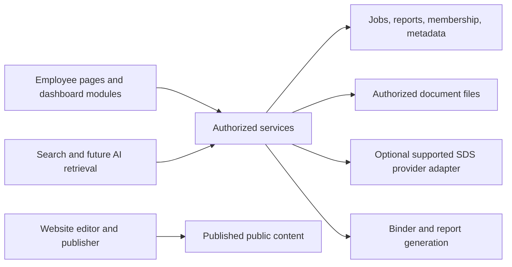

# Technical design direction

Draft implementation guidance, not an instruction to code. Existing-state observations are from local source inspection on September 14, 2026; this is not a full architecture, security, or production audit.

## Existing application foundations

| Area | Local evidence | Design implication |
| --- | --- | --- |
| Client | [package.json](../../package.json): Vue, Pinia, Vue Router, Vite, PrimeVue | Extend established patterns before selecting a new framework |
| Layout | [AppPageLayout](../../src/components/common/AppPageLayout.vue), [AppShell](../../src/layouts/AppShell.vue), common inputs/panes | Reuse for SDS and new employee modules |
| Routes | [router](../../src/router/index.ts): existing job, workflow, dashboard, and export routes | Preserve deep links and add SDS as an accessible full page |
| Job dashboard | [module definitions](../../src/features/jobs/jobDashboardModules.ts) and [view](../../src/views/JobDashboardView.vue) | Existing launcher for timecards, daily logs, and orders; not a configurable widget system |
| Permissions | [capabilities](../../src/auth/capabilities.ts), [stored roles](../../src/auth/roles.ts), [target capabilities](../../src/auth/targetRoleCapabilities.ts) | Extend the existing capability checks deliberately; titles alone do not establish new access |
| Backend | [firebase.json](../../firebase.json): Functions, Firestore, Storage, Hosting | Proposed document metadata/files can align with existing services; final model needs review |
| Email | [email service](../../functions/src/emailService.ts), [workflow email handlers](../../functions/src/operationsFunctions.ts), [timecard handlers](../../functions/src/timecardWeekFunctions.ts) | Microsoft Graph delivery and sender-routing behavior already exist |
| Verification | Package scripts for type checking, unit/browser tests, security-rule emulators, email/PDF smoke checks | Extend tests at the behavior and authorization boundaries |
| Branding | [design guide](../Phase2-Design-Guide.html) | Reuse existing identity; final screens still need visual review |

No SDS or site-visit implementation was identified by the targeted source search in this documentation pass. Do not interpret that as a complete code audit. Existing role/dashboard files mean portions of the older emails may already be implemented; verify behavior before planning migrations.

## Proposed boundaries

Initial SDS content is Admin-managed metadata and PDF uploads. A future optional provider adapter can normalize record identifiers, metadata, open/download capabilities, and retrieval failures. It should not dictate job permissions or dashboard layout. Vendor integration is not a prerequisite for this phase.

## SDS metadata and files

These are logical SDS domain entities, independent of where an explorer module is displayed. The reusable document explorer should consume a collection interface rather than assume every document has SDS metadata. Final storage can reuse common document/folder primitives while retaining the SDS-specific identity, revision, and membership rules below.

Proposed logical entities, with names subject to implementation review:

| Entity | Relationship |
| --- | --- |
| `sdsDocuments` | Stable product/document identity |
| `sdsRevisions` | Immutable revision referencing a provider record or stored file |
| `sdsFolders` / document placements | Ordered master hierarchy and document references; jobs derive a filtered view rather than copying the tree |
| `jobSdsMemberships` | Saved job checkbox selections by stable document ID, with selected revision and history |
| `sdsRequests` | Missing/incorrect sheet reports and resolution |
| `binderExports` | General/job scope, captured hierarchy/order/titles and revisions, contents page map, and generated PDF artifact |

Use stable IDs rather than mutable filenames or full vendor URLs as identity. Keep source metadata and checksums where available. Treat revision dates as document information; only explicit metadata establishes supersession/review status.

Ordinary job browsing/search derives from saved selected document IDs and their master ancestor folders. Edit mode exposes the master selection list to authorized job editors. Proposed folder selection expands to explicit document IDs at save time, so future master additions do not automatically enter existing job books. Saving selections needs validation and a concurrency check; selection changes must not mutate master records. Job inclusion is a view/output filter, separate from general-library read permission.

Do not immediately mandate full-text infrastructure. First determine sheet count, languages, scanned-PDF prevalence, search expectations, and provider capabilities. Metadata search may meet the first use case; OCR, document indexing, and semantic search are additional design choices. Any search index needs the same visibility boundary as its source records.

For Admin PDF ingestion, proposed stages are: Admin uploads to a restricted staging area → validate supported type/size and product metadata → Admin review → publish immutable revision. Admin is the confirmed master maintainer. The publisher must not expose a partly uploaded file. Decide scanning, size limits, and treatment of malformed/encrypted files before implementation.

For new SDS services, derive selection-edit and job-export authorization from the existing job-access predicate. Do not require the existing job-edit capability: the user explicitly includes everyone who can access a job. Recheck access for selection writes, export requests, and artifact retrieval. Master metadata, folder, file, and revision mutations require Admin. Keep these checks local to the new SDS services without changing the authorization of existing Jobs workflows.

Files should be delivered using an access model consistent with the reader's scope. Do not create permanent publicly readable job documents merely to make previewing simpler. Signed URLs, if selected, need deliberate lifetime and revocation tradeoffs.

## Binder generation

Combined PDF and printed books are confirmed for both the general master and job scope. Capture revision IDs, saved job selection where applicable, master hierarchy/order, and display titles into a manifest. A concurrent selection, organization, or revision change must not silently alter an export already in progress. UI search and collapsed folders do not change the export scope.

Render a cover and hierarchical table of contents, then merge complete source sheets in explorer order. Resolve contents pagination against the final assembled book, including multi-page contents and mixed page orientations. Proposed clickable contents and PDF bookmarks use the same hierarchy. PDF download and Print book use the same artifact. Preserve readability and original source content when adding any book page numbers; printed page references must remain usable without links.

For larger binders, use a tracked background operation with queued, running, complete, and failed states. Avoid holding the page in indefinite loading. Expensive retries need an operation identity and should not create duplicate artifacts. Validate membership and export permissions at request and retrieval. Retained artifacts and manifests are immutable snapshots; a new export uses the current saved state.

An externally linked sheet cannot be merged unless the provider supports retrieval and the company is allowed to reproduce it. Required book output therefore needs a file-capable source strategy; external links alone do not fulfill the requirement. Unchecked job sheets are deliberately excluded, while selected unavailable/malformed/encrypted sheets are unresolved export failures. Proposed behavior blocks final book output and identifies the affected sheets until resolved; never silently produce a complete-looking binder with missing sheets.

Offline app access and downloaded binder PDFs are different deliverables. If offline support is selected, design local manifests, freshness indicators, device storage boundaries, and access-loss behavior explicitly.

## Shared workspace entities

### Minimal dashboard and explorer foundation

Start with a small set of fixed module configurations rendered in existing responsive layouts. Proposed configuration fields: stable instance ID, module type, title, collection reference, scope reference, and display preferences such as initial folder. User-created layouts, drag/resize controls, a module marketplace, and a general configuration editor are not prerequisites; requested customization remains in later delivery stages.

Dashboard contexts are Personal (user ID), Role (role ID and authenticated viewer), and existing Job (job ID). Initial work adds distinct Personal and Role pages/navigation entries only. All existing Jobs pages and dashboards, components, routes, workflow options, access checks, and behavior remain untouched. Do not add an explorer to existing Job dashboards, refactor their pages, change the landing page, replace the jobs list, or redirect Jobs routes in this release. Additive navigation/shared infrastructure work must preserve existing Jobs behavior. The master SDS library remains a separate content route, not a dashboard scope.

For job-specific SDS, propose an authorized job-context selector in the new explorer and a separate SDS route namespace. It references existing job IDs without changing Job pages or their navigation. Existing job permissions govern access; neither choosing a job nor configuring the module grants access. This preserves job binder functionality while direct placement on existing Job dashboards is deferred.

Confirmed Role-dashboard purpose is consistent shared resources and tools for each role. Use a role-specific starting configuration and shared resource references with per-viewer authorized data queries; role layout membership does not grant all-job or personal-record access. Role layout/resource publishing ownership and multi-role switching remain open. A later jobs-list module should reuse job visibility and navigation behavior, with standalone Jobs-page retirement treated as a separate migration after workflow parity is reviewed.

Separate three responsibilities: the dashboard hosts modules; a shared explorer renders a document collection; authorized collection services provide organization, visible records, allowed actions, selection changes, and output. An SDS collection supplies SDS metadata and revision policy. A job SDS view supplies saved inclusion over the master collection. Neither the module's client configuration nor an arbitrary supplied scope ID grants access.

Reuse the same explorer and service operations for dashboard and expanded routes. Keep transient search, folder expansion, and preview state separate from saved job selection. Module instances reference an existing binder rather than own it, so displaying it twice or removing a future module instance cannot duplicate or delete data. A layout change must not trigger record creation or a document migration.

Expose action capabilities from the collection/service boundary: read/open, manage source organization, edit scoped selection, download, and generate/print book. Enforce each action on the server as well as in UI presentation. Book generation can share ordered revision manifests and pagination across compatible collections; supported file conversion remains collection-specific. SDS's required complete-document export behavior is preserved.

Use module-local loading/error handling and an Expand route. A failed explorer must leave dashboard navigation and existing job workflow links usable. Introducing the initial host must preserve current job/timecard/log/order routes and their permissions.

### Shared records

Proposed common references: job ID, user ID, role ID, future group ID, document/revision ID, report/template-version ID, task ID, and notification-event ID. Every record should have a defined owning scope and audit timestamps where appropriate. Role presentation context and a record's actual owner/audience are distinct.

Dashboards store layout and module configuration. They do not own separate copies of timecards, reports, tasks, or SDS files. Server operations and data queries enforce source access even if a client changes a module's job/group filter.

Report instances capture template version and submitted content. Versioned templates allow later changes without modifying historical answers. Existing daily log and timecard state machines should be retained until an explicitly planned, tested migration is necessary.

Public website drafts, published content, and employee information need distinct read/write boundaries. Reusing infrastructure is possible; sharing unrestricted collections or buckets is not an acceptable default. Hosting/domain configuration, preview access, and URL preservation need their own deployment plan.

## Integration decisions still open

| Integration | Required discovery |
| --- | --- |
| mSDS Source (optional later integration) | API/export/link support and content-use terms if integration is pursued; initial source is Admin-supplied metadata/PDFs |
| OSHA references/data | Actual user questions, authoritative sources, supported access, freshness/citation requirements |
| Calibrated Risk | Demonstrated workflow, sample report, desired similarity, any integration need and availability |
| Mapping | Required job location features, provider, usage costs and credentials |
| Spreadsheets | Export/import/embed/sync intent, file/provider formats, conflict and permission handling |
| MFA | Existing identity setup, IT preferences, supported factors, recovery and shared-device workflow |
| AI retrieval | Approved sources, document scope, citation evaluation, operational cost, retention and reviewer workflow |

Do not select a vendor or promise a current API based solely on pasted email recommendations. External research and account inspection should be a later, explicitly scoped discovery task; no secret values belong in the design set.

## Release protection

- Add new capabilities without globally broadening existing job or payroll access.
- Keep existing app routes, account setup links, galleries, and submission emails working during website changes.
- Keep every existing Jobs page/dashboard untouched while adding Personal/Role pages and separate SDS surfaces; verify unchanged layout, job selection, routes, permissions, and three workflow options. Review shared-component changes for effects on these screens.
- Verify migrated data with counts and representative records before retiring any old representation.
- Use reversible additive schema changes and release controls appropriate to the feature.
- Define ownership for failed document ingestion, stale sources, binder export failures, and report/email delivery errors.
- Log operational IDs and outcomes without document contents, credentials, or unnecessary personal data.

The first SDS release includes basic Personal and Role pages/tabs and separate master/job-context SDS views with the reusable explorer module. Existing Jobs dashboards/pages receive no changes. Job-dashboard integration and Jobs-page retirement are deferred; a custom role builder, user-configurable dashboards, and AI search are also not prerequisites.
